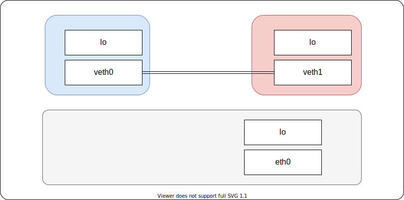

title: "Linux Networking Workshop: Network Namespaces"
author:
  name: Anton Ustyuzhanin
  twitter: antonu17
output: slides.html
controls: true

--

# Linux Networking Workshop

--

# Network Namespaces

--

### Purpose

The purpose of this workshop:

- Understanding mechanics of linux namespaces in general and network namespaces in particular
- What is Virtual Ethernet (`veth`) device and how to use it to establish communication between 2 different network namespaces.

--

### Outcomes

At the end of the workshop you learn:

- What Linux Namespaces are
- How to assign a process to a namespace
- Namespace lifecycle
- Lab: Create two network namespaces using `iproute2` and setup connectivity between them

--

### Namespace types

The following table shows the namespace types available on Linux.

| Namespace | Isolates |
|--|--|
| `cgroup` | Cgroup root directory |
| `ipc` | System V IPC, POSIX message queues |
| `mnt` | Mount points |
| `net` | Network devices, stacks, ports, etc. |
| `pid` | Process IDs |
| `user` | User and group IDs |
| `utc` | Hostname and NIS domain name |

--

### How to assign a process to a namespace

- **clone()**: Spawn a child process with a new namespace(s)
- **unshare()**: Create a new namespace without creating a new process
- **setns()**: Assign current process (thread) to an existing namespace

--

### Code example

```c
static int child_fn() {
    printf("new network namespace interfaces:\n");
    system("ip link");
    printf("\n");
    sleep(30);

    return 0;
}

int main() {
    printf("source network namespace interfaces:\n");
    system("ip link");
    printf("\n");

    pid_t childPid = clone(child_fn, stackTop, CLONE_NEWNET | SIGCHLD, NULL);

    if (waitpid(childPid, NULL, 0) == -1)    /* Wait for child */
        errExit("waitpid");

    exit(EXIT_SUCCESS);
}
```

--

Process running:

```bash
root@vm01:~# lsns -t net
        NS TYPE NPROCS   PID USER    NETNSID NSFS COMMAND
4026531992 net     103     1 root unassigned      /sbin/init
4026532265 net       1 27751 root unassigned      ./a.out
```

Process terminated:

```bash
root@vm01:~# lsns -t net
        NS TYPE NPROCS   PID USER    NETNSID NSFS COMMAND
4026531992 net     103     1 root unassigned      /sbin/init
```

--

### Namespace lifecycle

A namespace is automatically torn down when the last process in the namespace terminates or leaves the namespace.

--

### Lsns

Query all available namespaces that have running process

```bash
vagrant@vm01:~$ sudo lsns
        NS TYPE   NPROCS   PID USER            COMMAND
4026531835 cgroup    100     1 root            /sbin/init
4026531836 pid       100     1 root            /sbin/init
4026531837 user      100     1 root            /sbin/init
4026531838 uts        98     1 root            /sbin/init
4026531839 ipc       100     1 root            /sbin/init
4026531840 mnt        95     1 root            /sbin/init
4026531860 mnt         1    15 root            kdevtmpfs
4026531992 net       100     1 root            /sbin/init
4026532164 mnt         1   378 root            /lib/systemd/systemd-udevd
4026532165 uts         1   378 root            /lib/systemd/systemd-udevd
4026532166 mnt         1  4056 systemd-network /lib/systemd/systemd-networkd
4026532185 mnt         1   549 systemd-resolve /lib/systemd/systemd-resolved
4026532250 mnt         1   611 root            /lib/systemd/systemd-logind
4026532317 uts         1   611 root            /lib/systemd/systemd-logind
```

--

### Namespace information in /proc

Each process has a `/proc/[pid]/ns/` subdirectory containing one entry for each namespace.

```bash
vagrant@vm01:~$ ls -l /proc/$$/ns
total 0
lrwxrwxrwx 1 vagrant vagrant 0 Apr 20 14:13 cgroup -> 'cgroup:[4026531835]'
lrwxrwxrwx 1 vagrant vagrant 0 Apr 20 14:13 ipc -> 'ipc:[4026531839]'
lrwxrwxrwx 1 vagrant vagrant 0 Apr 20 14:13 mnt -> 'mnt:[4026531840]'
lrwxrwxrwx 1 vagrant vagrant 0 Apr 20 14:13 net -> 'net:[4026531992]'
lrwxrwxrwx 1 vagrant vagrant 0 Apr 20 14:13 pid -> 'pid:[4026531836]'
lrwxrwxrwx 1 vagrant vagrant 0 Apr 20 15:17 pid_for_children -> 'pid:[4026531836]'
lrwxrwxrwx 1 vagrant vagrant 0 Apr 20 14:13 user -> 'user:[4026531837]'
lrwxrwxrwx 1 vagrant vagrant 0 Apr 20 14:13 uts -> 'uts:[4026531838]'
```

Bind mounting one of the files in this directory to somewhere else in the filesystem keeps the corresponding namespace of the process specified by pid alive even if all processes currently in the namespace terminate.

--

### Network namespaces

Network namespace isolates:

- Network interfaces
- TCP/IP stack (ports)
- Routing tables
- Iptables chains

--

### Veth devices

The `veth` devices are virtual Ethernet devices. They can act as tunnels between network namespaces to create a bridge to a physical network device in another namespace.
`veth` devices are always created in interconnected pairs. A pair can be created using the command:

```bash
ip link add <p1-name> type veth peer name <p2-name>
```

In the above, `p1-name` and `p2-name` are the names assigned to the two connected end points.

--

# LAB

--

# Boot a linux VM

--

### Boot a linux VM

```bash
vagrant up
```

After system boots up we get a single network namespace, aka root namespace

---

### Boot a linux VM


--

# Create network namespaces

--

### Create network namespaces

Add network namespaces

```bash
ip netns add blue
ip netns add red
```

What does `ip netns add` do

```
root@vm01:~# strace ip netns add blue

openat(AT_FDCWD, "/proc/self/ns/net", O_RDONLY|O_CLOEXEC) = 5
unshare(CLONE_NEWNET)                   = 0
mount("/proc/self/ns/net", "/run/netns/blue", 0x55a8ed78967f, MS_BIND, NULL) = 0
setns(5, CLONE_NEWNET)                  = 0
```

List network namespaces:

```
root@vm01:~# ip netns list
red
blue
```

---

### Create network namespaces


--

# Create veth pair

--

### Create veth pair

Add network interfaces

```bash
ip link add veth0 type veth peer name veth1
```

List network interfaces

```
root@vm01:~# ip link show
1: lo: <LOOPBACK,UP,LOWER_UP> mtu 65536 qdisc noqueue state UNKNOWN mode DEFAULT group default qlen 1000
    link/loopback 00:00:00:00:00:00 brd 00:00:00:00:00:00
2: eth0: <BROADCAST,MULTICAST,UP,LOWER_UP> mtu 1500 qdisc fq_codel state UP mode DEFAULT group default qlen 1000
    link/ether 08:00:27:14:86:db brd ff:ff:ff:ff:ff:ff
3: eth1: <BROADCAST,MULTICAST,UP,LOWER_UP> mtu 1500 qdisc fq_codel state UP mode DEFAULT group default qlen 1000
    link/ether 08:00:27:4f:f8:b6 brd ff:ff:ff:ff:ff:ff
4: docker0: <NO-CARRIER,BROADCAST,MULTICAST,UP> mtu 1500 qdisc noqueue state DOWN mode DEFAULT group default
    link/ether 02:42:d4:71:c9:bc brd ff:ff:ff:ff:ff:ff
5: veth1@veth0: <BROADCAST,MULTICAST,M-DOWN> mtu 1500 qdisc noop state DOWN mode DEFAULT group default qlen 1000
    link/ether ca:a0:db:91:71:80 brd ff:ff:ff:ff:ff:ff
6: veth0@veth1: <BROADCAST,MULTICAST,M-DOWN> mtu 1500 qdisc noop state DOWN mode DEFAULT group default qlen 1000
    link/ether 52:3d:b3:73:c8:45 brd ff:ff:ff:ff:ff:ff
```

---

### Create veth pair


--

# Assign veth interfaces to namespaces

--

### Assign veth interfaces to namespaces

Assign interfaces to namespaces

```bash
ip link set dev veth0 netns blue
ip link set dev veth1 netns red
```

List network interfaces

```
root@vm01:~# ip link show
1: lo: <LOOPBACK,UP,LOWER_UP> mtu 65536 qdisc noqueue state UNKNOWN mode DEFAULT group default qlen 1000
    link/loopback 00:00:00:00:00:00 brd 00:00:00:00:00:00
2: eth0: <BROADCAST,MULTICAST,UP,LOWER_UP> mtu 1500 qdisc fq_codel state UP mode DEFAULT group default qlen 1000
    link/ether 08:00:27:14:86:db brd ff:ff:ff:ff:ff:ff
3: eth1: <BROADCAST,MULTICAST,UP,LOWER_UP> mtu 1500 qdisc fq_codel state UP mode DEFAULT group default qlen 1000
    link/ether 08:00:27:4f:f8:b6 brd ff:ff:ff:ff:ff:ff
4: docker0: <NO-CARRIER,BROADCAST,MULTICAST,UP> mtu 1500 qdisc noqueue state DOWN mode DEFAULT group default
    link/ether 02:42:d4:71:c9:bc brd ff:ff:ff:ff:ff:ff
```

--

### Assign veth interfaces to namespaces



--

# Assign IP addresses

--

### Assign IP addresses

Bring interfaces up and assign addresses

```bash
ip netns exec blue ip link set lo up
ip netns exec blue ip link set veth0 up
ip netns exec blue ip address add 10.1.0.2/24 dev veth0
ip netns exec red ip link set lo up
ip netns exec red ip link set veth1 up
ip netns exec red ip address add 10.1.0.3/24 dev veth1
```

Check ping `red` IP from `blue` namespace

```
root@vm01:~# ip netns exec blue ping -c 5 10.1.0.3
PING 10.1.0.3 (10.1.0.3) 56(84) bytes of data.
64 bytes from 10.1.0.3: icmp_seq=1 ttl=64 time=0.314 ms
64 bytes from 10.1.0.3: icmp_seq=2 ttl=64 time=0.055 ms
64 bytes from 10.1.0.3: icmp_seq=3 ttl=64 time=0.044 ms
64 bytes from 10.1.0.3: icmp_seq=4 ttl=64 time=0.052 ms
64 bytes from 10.1.0.3: icmp_seq=5 ttl=64 time=0.056 ms
```

--

### Assign IP addresses


---

# References

---

### References

- https://man7.org/linux/man-pages/man7/namespaces.7.html
- https://man7.org/linux/man-pages/man7/network_namespaces.7.html
- https://man7.org/linux/man-pages/man4/veth.4.html
- https://baturin.org/docs/iproute2/
