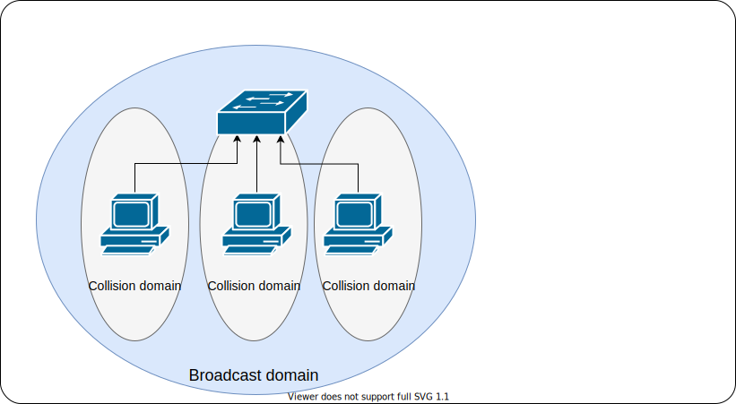

title: "Linux Networking Workshop: Network Namespaces"
author:
  name: Anton Ustyuzhanin
  twitter: antonu17
output: slides.html
controls: true

--

# Linux Networking Workshop

--

### Previously on Linux Networking Workshop

#### Network Namespaces

- Linux namespaces types and lifecycle (`clone()`, `unshare()`, `setns()`, `/proc/<pid>/ns/`)
- What do network namespaces isolate: interfaces, tcp/ip stack (routing), iptables rules
- What is `veth`: a pair of 2 interconnected network interfaces - a pipe.
- How to setup point-to-point networking between 2 containers using a single `veth` pair

--

# Network Bridges

--

### Purpose

At the end of the workshop you learn:

- What is collision domain
- IEEE 802.1D Bridge: Learning, Forwarding, FIB
- Linux Bridges and tools
- Open vSwitch and tools

--

### LAB

- Create bridge device and 4 network namespaces (aka containers)
- Connect each container to bridge using `veth` pairs
- Configure IP on root bridge and new containers
- Enable Internet access for containers

--

# Collision domain

--

### Collision domain

A collision domain is a network segment connected by a shared medium.

The collision domain applies particularly in wireless networks, but also affected early versions of Ethernet.

A network collision occurs when more than one device attempts to send a packet on a network segment at the same time.

--

### Collision domain


--

# IEEE 802.1D Bridge

--

### Funcion of a bridge

A network bridge is a computer networking device that creates a single network from multiple network segments.

In a bridged network communication between two hosts is possible without "flooding". Bridges reduce collisions
by creating a separate collision domain per interface (port).

A multiport bridge is often called network switch.

--

### Funcion of a bridge



--

### Learning and FIB

For each received ethernet frame the switch learns from the frame's source MAC address and adds this together with an port
identifier to the forwarding information base (FIB).

When bridge receives a frame it searches for the frame's destination address (MAC) in FIB to forward (or send) the frame to the exactly one port.

If the destination address is unknown the switch sends the frame out on all ports (except the ingress port).

--

# Software bridge

--

### Common operations

- Create or delete a bridge
- Add or remove bridge interfaces
- Show current bridge / interfaces configuration

--

# Linux Bridge

--

### Linux Bridge

A Linux bridge is a piece of software used to interconnect two or more network segments.

A Linux bridge behaves like a network switch. It forwards packets between interfaces that are connected to it.
It's usually used for forwarding between VMs and network namespaces on a host.

A Linux bridge is more powerful than a pure hardware bridge because it can also filter and shape traffic.

--

### Linux Bridge Tools

Tools to configure linux bridges:

- bridge-utils (brctl) **obsolete**
- iproute2 (ip link type bridge)

--

### Linux Bridge Tools: bridge-utils

```
Usage: brctl [commands]
commands:
	addbr     	<bridge>		add bridge
	delbr     	<bridge>		delete bridge
	addif     	<bridge> <device>	add interface to bridge
	delif     	<bridge> <device>	delete interface from bridge
	hairpin   	<bridge> <port> {on|off}	turn hairpin on/off
	setageing 	<bridge> <time>		set ageing time
	setbridgeprio	<bridge> <prio>		set bridge priority
	setfd     	<bridge> <time>		set bridge forward delay
	sethello  	<bridge> <time>		set hello time
	setmaxage 	<bridge> <time>		set max message age
	setpathcost	<bridge> <port> <cost>	set path cost
	setportprio	<bridge> <port> <prio>	set port priority
	show      	[ <bridge> ]		show a list of bridges
	showmacs  	<bridge>		show a list of mac addrs
	showstp   	<bridge>		show bridge stp info
	stp       	<bridge> {on|off}	turn stp on/off
```

--

### Linux Bridge Tools: bridge-utils

Create or delete a bridge

```bash
brctl addrb bridge0 # create bridge0
brctl delrb bridge0 # delete bridge0
```

Add or remove bridge interfaces

```bash
brctl addif bridge0 veth0 # add veth0 to bridge0
brctl delif bridge0 veth0 # delete veth0 from bridge0
```

Show current bridge / interfaces configuration

```bash
brctl show
```

--

### Linux Bridge Tools: iproute2

Create or delete a bridge

```bash
ip link add name bridge0 type bridge # create bridge0
ip link delete dev bridge0           # delete bridge0
```

Add or remove bridge interfaces

```bash
ip link set dev veth0 master bridge0 # add veth0 to bridge0
ip link set dev veth0 nomaster       # delete veth0 from bridge0
```

Show current bridge / interfaces configuration

```bash
ip link show type bridge
bridge link show
```

--

### Linux Bridge Tools: iproute2

`iproute2` provides tool called `bridge` which enables advanced configuration of bridge ports
like filtering, mac-learning, STP, and manipulating FIB entries directly.

--

# Open vSwitch

--

### Open vSwitch

Open vSwitch is a production quality, multilayer virtual switch. It is designed to enable massive
network automation through programmatic extension, while still supporting standard management
interfaces and protocols.

Features:

- Standard 802.1Q VLAN model with trunk and access ports
- NIC bonding with or without LACP on upstream switch
- NetFlow, sFlow(R), and mirroring for increased visibility

--

### Open vSwitch features

- QoS (Quality of Service) configuration, plus policing
- Geneve, GRE, VXLAN, STT, and LISP tunneling
- 802.1ag connectivity fault management
- OpenFlow 1.0 plus numerous extensions
- Transactional configuration database with C and Python bindings
- High-performance forwarding using a Linux kernel module

--

### Open vSwitch Components

- `ovs-vswitchd`, a daemon that implements the switch, along with a companion Linux kernel module for flow-based switching.
- `ovsdb-server`, a lightweight database server that ovs-vswitchd queries to obtain its configuration.
- `ovs-dpctl`, a tool for configuring the switch kernel module.
- `ovs-vsctl`, a utility for querying and updating the configuration of ovs-vswitchd.
- `ovs-appctl`, a utility that sends commands to running Open vSwitch daemons.

--

### Open vSwitch Tools

Create or delete a bridge

```bash
ovs-vsctl add-br bridge0 # create bridge0
ovs-vsctl del-br bridge0 # delete bridge0
```

Add or remove bridge interfaces

```bash
ovs-vsctl add-port bridge0 veth0 # add veth0 to bridge0
ovs-vsctl del-port bridge0 veth0 # delete veth0 from bridge0
```

Show current bridge / interfaces configuration

```bash
ovs-vsctl show
```

--

# LAB

--

### Create Namespaces

```bash
ip netns add blue
ip netns add green
ip netns add red
ip netns add brown
```

--

### Create Interfaces

```bash
ip link add name bridge0 type bridge

ip link add blue0  type veth peer name blue1
ip link add green0 type veth peer name green1
ip link add red0   type veth peer name red1
ip link add brown0 type veth peer name brown1
```

--

### Create Interfaces


--

### Setup Wiring

```bash
ip link set dev blue1 netns blue
ip link set dev green1 netns green
ip link set dev red1 netns red
ip link set dev brown1 netns brown

ip link set dev blue0 master bridge0
ip link set dev green0 master bridge0
ip link set dev red0 master bridge0
ip link set dev brown0 master bridge0
```

--

### Setup Wiring


--

### Configure Interfaces

```bash
ip address add 10.1.0.1/24 dev bridge0
ip link set dev bridge0 up

ip link set dev blue0 up
ip link set dev green0 up
ip link set dev red0 up
ip link set dev brown0 up

ip -n blue  address add 10.1.0.2/24 dev blue1
ip -n blue link set dev lo up
ip -n blue link set dev blue1 up

ip -n green address add 10.1.0.3/24 dev green1
ip -n green link set dev lo up
ip -n green link set dev green1 up

ip -n red address add 10.1.0.4/24 dev red1
ip -n red link set dev lo up
ip -n red link set dev red1 up

ip -n brown address add 10.1.0.5/24 dev brown1
ip -n brown link set dev lo up
ip -n brown link set dev brown1 up
```

--

### Configure Interfaces


--

### Check IP connectivity

```bash
ping -c 1 10.1.0.2
ping -c 1 10.1.0.3
ping -c 1 10.1.0.4
ping -c 1 10.1.0.5

ip netns exec blue  ping -c 1 10.1.0.3 # blue ping green
ip netns exec blue  ping -c 1 10.1.0.4 # blue ping red
ip netns exec green ping -c 1 10.1.0.5 # green ping brown
```

--

### Enable Internet Access for containers

```bash
# Add default gateway on containers
ip -n blue  route add default via 10.1.0.1
ip -n green route add default via 10.1.0.1
ip -n red   route add default via 10.1.0.1
ip -n brown route add default via 10.1.0.1

# Enable IP Routing
sysctl -w net.ipv4.ip_forward=1

# Enable NAT for source subnet 10.1.0.0/24
iptables -t nat -A POSTROUTING -s 10.1.0.0/24 -j MASQUERADE
```

--

# References

--

### References

- https://man7.org/linux/man-pages/man8/brctl.8.html
- https://man7.org/linux/man-pages/man8/ip-link.8.html
- https://man7.org/linux/man-pages/man8/bridge.8.html
- https://baturin.org/docs/iproute2/
- https://www.openvswitch.org/
